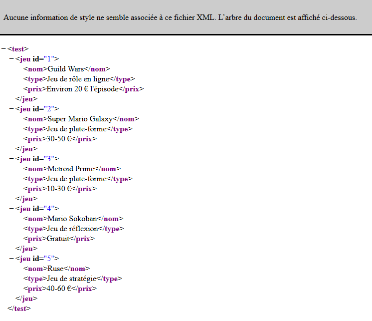
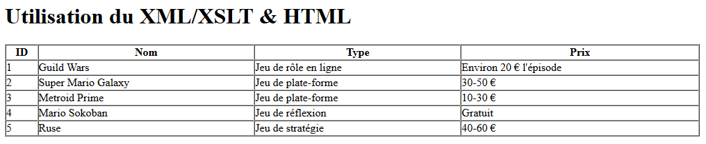

# Découverte du language XSLT (eXtensible Stylesheet Language Transformations)

Le language XSLT [définit par le W3C](http://www.w3schools.com/xml/xsl_intro.asp) est utilisé pour mettre en forme le contenu d'une page XML (eXtended Markup Language) qui est un language de balisage extensible où l'on peut définir nos propres balises. La naviguation dans le document peut se faire avec php en utilisant Xpath (moyen de naviguer dans le document), __mais ici on peut le faire directement via le XSLT__ _et lui aussi utilise Xpath pour cibler les éléments_.

Quand on ouvre le XML dans un naviguateur, nous avons normalement ce genre de rendu en arbre et n'est donc pas prit en charge comme le html :   


Avec le XSLT, on peut facilement obtenir ce résultat là (on pourait également rajouter du CSS) :   
   


## Pour démarrer 

J'ai suivit [ce tuto sur l'openclassroom](https://openclassrooms.com/courses/les-bases-de-la-mise-en-forme-xml-avec-xslt), où l'on explique succintement les bases du language XSLT : https://openclassrooms.com/courses/les-bases-de-la-mise-en-forme-xml-avec-xslt

Ici je vais mettre uniquement quelques infos condenssée et utile. N'hésitez pas à regarder mon code d'exemple, car je l'ai largement commenté : [./index.xsl](./index.xsl)

Dans un future proche je compte me faire quelques snipets XSLT, alors n'hésitez pas à revenir; je les mettrai tout à la fin du document.

### Les grands principes

#### Canvas de base
Pour le XML il faut mettre la première ligne commune à tous les fichiers xml et ajouter une seconde ligne où l'on cible la page `".xsl"`. Vous nommerez le document avec l'extenssion __".xml"__ :
``` XML
<?xml version="1.0" encoding="utf-8"?>
<?xml-stylesheet href="./nomDeVotreFichier.xsl" type="text/xsl"?>
```   
> Et ensuite vous y ajoutez votre balise racine et tout ses enfants

Pour le XSLT, voici la structure de base à lui appliquer. Vous nommerez le document avec l'extenssion __".xsl"__ :
``` XSL
<?xml version="1.0" encoding="utf-8"?>
<!-- On déclare les entités ici. Pour en ajouter (https://www.w3.org/TR/REC-html40/sgml/entities.html), le faire à la suite de celles-ci : -->
<!DOCTYPE xsl:stylesheet  [
	<!ENTITY nbsp   "&#160;">
    <!ENTITY copy   "&#169;">
    <!ENTITY reg    "&#174;">
    <!ENTITY trade  "&#8482;">
    <!ENTITY mdash  "&#8212;">
    <!ENTITY ldquo  "&#8220;">
    <!ENTITY rdquo  "&#8221;">
    <!ENTITY pound  "&#163;">
    <!ENTITY yen    "&#165;">
    <!ENTITY euro   "&#8364;">
]>

<!-- Déclaration pour le code XSLT -->
<xsl:stylesheet version="1.0" xmlns:xsl="http://www.w3.org/1999/XSL/Transform">
    <xsl:output method="html" encoding="utf-8" doctype-public="-//W3C//DTD XHTML 1.0 Transitional//EN" doctype-system="http://www.w3.org/TR/xhtml1/DTD/xhtml1-transitional.dtd"
    />
    <xsl:template match="/">

        <!-- Déclaration de votre code HTML :
            Vous pouvez utiliser tout code qu'une page HTML peut gérer (balises HTML classiques, CSS et même JavaScript).
            /!\ ATTENTION /!\ : il est impossible d'exploiter du contenu dynamique avec PHP, ici directment, mais vous pouvez l'inclure via php.
        -->

    </xsl:template>
</xsl:stylesheet>
```
> À l'endroit prévu pour le code html, si vous voulez __afficher le document xml seul__ comme une page d'affichage html, vous devez mettre les balises classiques pour un document html _(html>(head>title)+body)_.  
> Par contre si vous voulez __l'intégrer _(via php)_ dans une autre page__, ne mettez pas la structure de base du document html, il héritera de celle de son parent. Ne mettez que les balises de contenus directment (section, nav, ul, table, tr, th, td, ...).

#### Faire une boucle
``` XSL
<xsl:for-each select="test/jeu"><!-- select="RACINE/ENFANT" -->
    <ul>
        <li>ID : <xsl:value-of select="@id"/></li><!-- @ pour cibler un attribut -->
        <li>Nom : <xsl:value-of select="nom"/></li><!-- pour cibler une balise -->
        <li>Type : <xsl:value-of select="type"/></li>
        <li>Prix : <xsl:value-of select="prix"/></li>
    </ul>
</xsl:for-each>
```

#### La condition si
``` XSL
<xsl:for-each select="test/jeu">
    <xsl:if test="nom = 'Mario Sokoban'">
        <p>J'ai Mario Sokoban !</p>
    </xsl:if>
    <xsl:if test="nom = 'Metroid Prime'">
        <p>J'ai Metroid Prime !</p>
    </xsl:if>
</xsl:for-each>
```
J'ai essayé de faire un if else en utilisant sur le deuxième if avec l'opérateur de comparaison `!` not().   
Quand il ne retourne un false à la condition, cela fonctionne correctement et exécute le second if, mais le problème est quand il retourne un true, il exécute le premier if et le second, alors que le second ne devrait plus s'afficher.   
Je pense que la seule solution est d'alors [passer pas le "switch"](#le-switch)
``` XSL
<xsl:if test="test/jeu[nom = 'Mario Sokoban']"> <!-- test="balise [opérateur de comparaison] valeur" si valeur est un nombre, le mettre tel quel si il est une chaine de carractère mettre les guillemets simple `'` -->
    <p>J'ai Mario Sokoban !</p>
</xsl:if>
<xsl:if test="test/jeu[nom != 'Mario Sokoban']">
    <p>Je n'ai pas Mario Sokoban !</p>
</xsl:if>
```

#### Le "switch"
``` XSL
<xsl:choose> 
    <xsl:when test=""> 

    </xsl:when> 
    <xsl:otherwise> 

    </xsl:otherwise> 
</xsl:choose>
```

## Intégrer en php le xml et le xslt
``` PHP
<?php
   $xslDoc = new DOMDocument();
   $xslDoc->load("sommaire.xsl");

   $xmlDoc = new DOMDocument();
   $xmlDoc->load("chapitre.xml");

   $proc = new XSLTProcessor();
   $proc->importStylesheet($xslDoc);
   echo $proc->transformToXML($xmlDoc);
?>
```